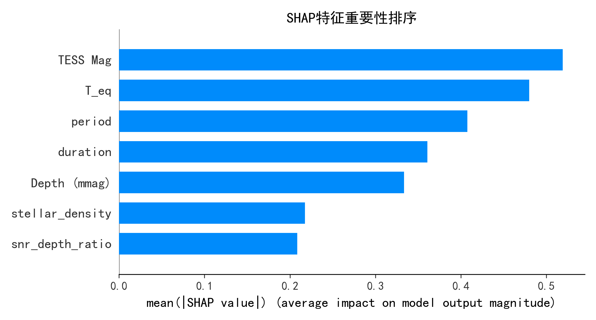
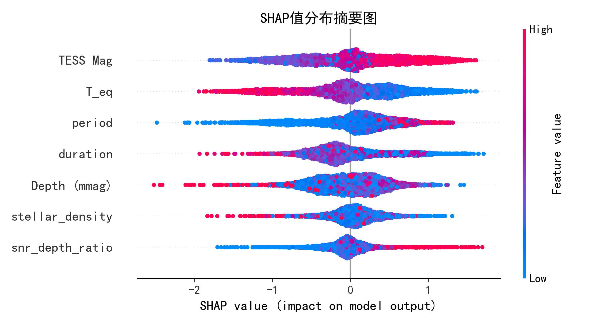

# 基于统计特征增强的轻量化行星检测模型  
**——天文时序数据分析的创新方法**  

[](https://www.python.org/downloads/)
[](https://www.tensorflow.org/)
[](https://lightgbm.readthedocs.io/)

本仓库包含用于 TESS 任务数据的系外行星候选体检测的混合深度学习模型实现。所提出的方法集成了**统计特征工程**、**DNN 特征抽象**和**LightGBM 分类**，以低计算成本实现高准确率，解决了传统方法误检率高、对小信号敏感度不足等问题。

---

## 📌 项目概述  
传统系外行星检测方法计算复杂度高（O(n²) 级运算），且对微弱信号敏感性不足。我们提出了一种**轻量化混合模型**，结合深度神经网络（DNN）与 LightGBM，并引入**多尺度统计特征引擎（MSSFE）**，提取时域（偏度/峰度）、频域（小波包能量熵）和相位折叠域特征，在 TESS 候选体数据上实现了先进性能。

**主要结果**（10 折交叉验证）：  
- **AUC**：0.822 ± 0.060  
- **F1 分数**：0.918 ± 0.015  
- **精确率**：0.906 ± 0.019  
- **准确率**：0.858 ± 0.026  

---

## ✨ 亮点  
- **多尺度统计特征引擎** – 通过时/频/相位分析增强微弱行星信号  
- **混合 DNN-LightGBM 架构** – 融合深度特征提取与梯度提升，实现鲁棒分类  
- **轻量化设计** – 参数量减少 42%，适合星载实时处理  
- **SHAP 可解释性分析** – 揭示关键天体物理驱动因素（如 TESS 星等、平衡温度）  
- **完备的数据预处理** – 缺失值处理、异常值截断（5%~95% 分位数）、物理约束过滤  

---

## 📊 数据集  
使用 **TESS 感兴趣天体（TOI）目录**，包含 6397 条候选记录，涵盖 21 个特征（光变曲线指标、恒星参数、行星属性）。  

**预处理步骤**（见 `data_preprocessing.py`）：  
- 关键字段（`disposition`、`period`、`TESS Mag`）空值剔除  
- 物理约束过滤（如行星半径 ∈ [0.1, 30] R⊕，信噪比 ≥ 7）  
- 异常值采用 5%~95% 分位数截断  
- 特征工程：轨道半长轴、平衡温度、恒星密度、深度变化率、信噪比-深度比  

**目标标签**：  
- **正类**：KP（已确认行星）、CP（候选行星）、PC（行星候选体）、APC（已验证候选体）  
- **负类**：FP（假阳性）、FA（假警报）  

---

## 🧠 方法  

### 1. 特征工程  
- **轨道重构**：基于开普勒第三定律计算半长轴  
- **恒星密度**计算  
- **时序动态特征**：凌星深度滚动标准差、信噪比-深度比  
- 使用鲁棒标准化（中位数 + IQR）抵抗异常值  

### 2. 混合模型架构  
- **DNN**：4 层全连接网络，含批标准化与 Dropout（0.3/0.2），ReLU 激活，Sigmoid 输出  
- **LightGBM**：梯度提升树，经贝叶斯优化超参数（叶子数=31，学习率=0.05 等）  
- **集成策略**：DNN 与 LightGBM 预测加权平均（α=0.6，经网格搜索确定）  

### 3. 特征选择  
使用 SHAP 值评估特征重要性，保留前 7 个核心特征：  
`TESS 星等`、`平衡温度`、`轨道周期`、`凌星持续时间`、`凌星深度`、`恒星密度`、`信噪比-深度比`  

---

## 📈 结果  

### 性能指标（50 折分层交叉验证）  
| 指标      | 均值 ± 标准差  |
|-----------|----------------|
| AUC       | 0.822 ± 0.060  |
| F1 分数   | 0.918 ± 0.015  |
| 精确率    | 0.906 ± 0.019  |
| 准确率    | 0.858 ± 0.026  |

### 混淆矩阵（全局）  
- 真正例：**5,096**  
- 假负例：**364**  
- 假正例：**553**  
- 真负例：依测试集而定  

**召回率**：93.3% | **精确率**：90.3%  

### 特征重要性（SHAP）  
    
  

---

## 🛠 安装与使用  

### 环境要求  
- Python 3.8+  
- TensorFlow 2.x  
- LightGBM  
- scikit-learn、pandas、numpy、matplotlib、seaborn、shap  

安装依赖：  
```bash
pip install pandas numpy lightgbm tensorflow scikit-learn matplotlib seaborn shap
```

## 运行代码
1. **准备数据**：将 TESS 数据文件（例如`tess_raw_data.xlsx`）放在项目根目录。
2. **执行主流程**：
```
python main.py
```
该脚本将依次执行数据预处理、特征工程、交叉验证，并生成所有图表（指标趋势、混淆矩阵、SHAP 图）。
## 主要脚本
- `main.py`-完整训练与评估流程
- `data_preprocessing.py`-数据加载、清洗与特征工程
- `model.py`-DNN 和 LightGBM 混合模型定义
- `visualization.py`-绘图工具（数据分布、指标、SHAP）


## 📁 仓库结构

```text
|   data-download.py # 下载数据
|   tess_raw_data.xlsx # 源数据
|   train-dnn_lightgbm-model.py # 训练模型
|
+---final-data
|       COM_PowerSpect_CMB-base-plikHM-TTTEEE-lowl-lowE-lensing-minimum-theory_R3.01.txt
|       COM_PowerSpect_CMB-base-plikHM-TTTEEE-lowl-lowE-lensing-minimum_R3.01.txt
|
\---photo
        average_metrics.png
        confusion_matrix.png
        cross_validation_metrics.png
        data_visualization.png
        feature_importance.png
        metrics_trend.png
        shap_feature_importance.png
        shap_summary.png
```
存在问题与改进方向

当前模型仍存在一些局限，例如：

对低信噪比信号的识别能力仍有提升空间

对长周期行星受 TESS 观测窗口限制较大

可继续引入多源数据融合和更强的数据增强策略

未来可以考虑：

引入更强的降噪模块

融合 Kepler / CHEOPS 等多任务数据

扩展到更长周期候选体检测

尝试更完整的端到端时序建模框架


